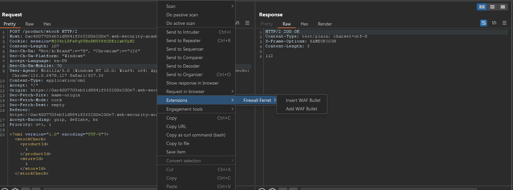
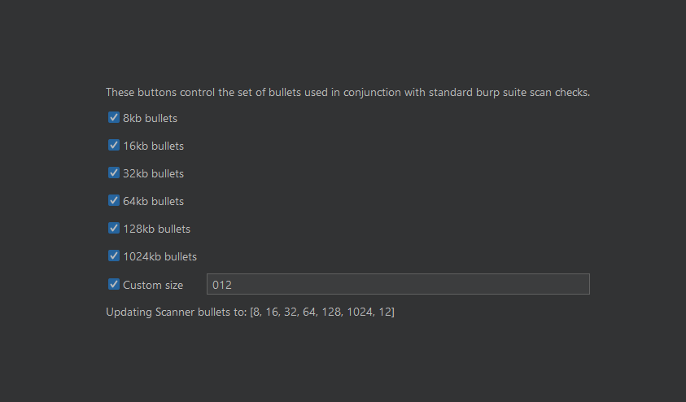

# Firewall Ferret
This java project was created with Portswigger's Montoya API to be a 
Burp Extension. It's well known that WAFs only scan up to a certain amount of data
per request. This extension allows a tester to manually insert junk data and 
adds junk data to Active Scans by duplicating each scan check. 

---

## Table of Contents
1. [Functionalities](#functionalities)
2. [How to Use the Different Functionalities](#how-to-use-the-different-functionalities)
3. [How to Configure the Extension](#how-to-configure-extension)
4. [Common WAF Limits](#common-waf-limits)
5. [How to Add Manually Extension to Burp Suite](#how-to-add-manually-extension-to-burp-suite)
6. [How to Install Extension from Burp Suite BAPP Store](#how-to-install-extension-from-burp-suite-bapp-store)

---

## Functionalities

This extension provides a few functionalities.
1. The option to manually insert a bullet of X Kilobyte
2. The option to allow the extension to add a parameter of bullet of X Kilobyte
   1. The following requests are supported: URL-Encoded Body, JSON, XML, Multipart
   2. The following requests are a work in progress: AMF
   3. If the request's content type of unknown to Burp, then the extension will 
   append the entire body with a bullet.
3. Adds a check for every burp active scan check. The check will take the standard
payload and prepend a bullet of the following sizes: `8, 16, 32, 64, 128, 1024`. 
This should lead to better scan results since most applications have WAFs in front.

## How to Use the Different Functionalities
### Automatic Insert 
The automatic insert works for requests URL-Encoded, JSON, XML, Multipart bodies. 
The bullet will be added as the first argument in the request.

**Auto Add Examples**

https://github.com/user-attachments/assets/231276a9-2629-4138-8778-211ff069b69c

### Manual Insert
The manual insert works by adding a bullet (a * X * 1024) where you're caret is.

**Manual Insert Example**

https://github.com/user-attachments/assets/1ff49890-575d-4f87-8121-780b23ff1ebb

### Active Scan
The extension runs additional checks when the default active scan is used. If you
require this feature to be disabled, uncheck all the boxes on the extension's settings tab.

## How to Configure Extension
1. Click on `Firewall Ferret` tab
2. Select the bullets you want the scanner to try with its payloads

The extension will automatically update what the scanner uses when you click a checkbox

## Common WAF Limits
| WAF Provider          | Maximum Request Body Inspection Size Limit             |
|-----------------------|--------------------------------------------------------|
| Radware AppWall       | up to 1 GB for cloud WAF                               |
| Cloudflare            | 128 KB for ruleset engine, up to 500 MB for enterprise |
| Fortiweb by Fortinet  | 128 MB                                                 |
| F5 BIG-IP WAAP        | 20 MB (configurable)                                   |
| Sucuri                | 8 MB                                                   |
| Palo Alto             | 8 MB                                                   |
| Akamai                | 8 KB - 128 KB                                          |
| Cloud Armor by Google | 8 KB (can be increased to 128 KB)                      |
| Azure WAF             | 128 KB - 4MB                                           |
| Barracuda WAF         | 64 KB                                                  |
| AWS WAF               | 8 KB - 64 KB (configurable depending on service)       |

## How to add manually extension to Burp Suite

https://github.com/user-attachments/assets/6f03e6b0-f8c6-4ac3-b573-6581461740bb

1. Download the latest release [here](https://github.com/ahanel13/Firewall-Ferret/releases)
2. Open the Extensions tab in Burp Suite
3. Click Add and then add the extension as a Java extension
4. Close pop-up

## How to install extension from Burp Suite BAPP store
_Not yet available_
1. Open the Extensions tab in Burp Suite
2. Click BAPP store
3. Search for `Firewall Ferret`
4. Click Install
